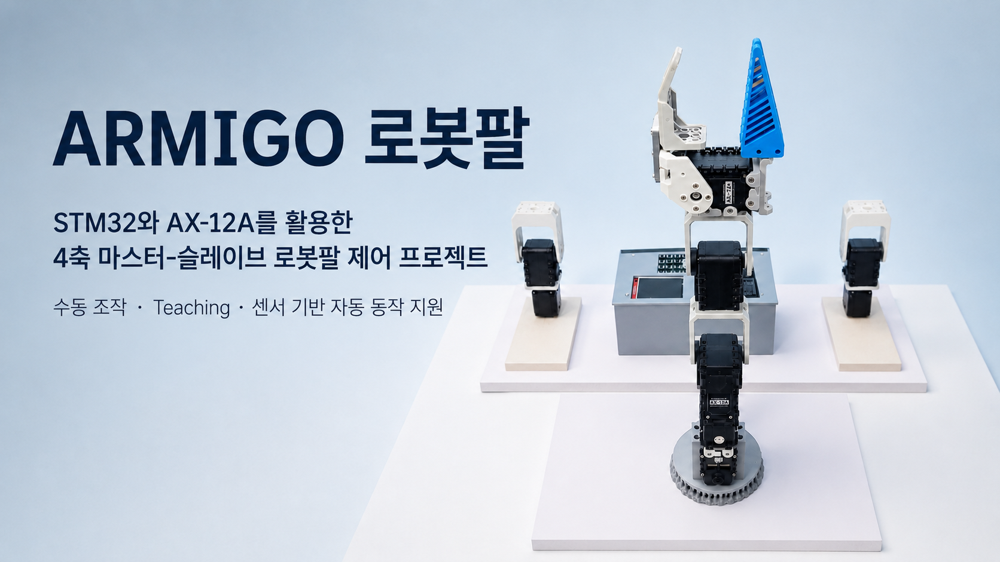
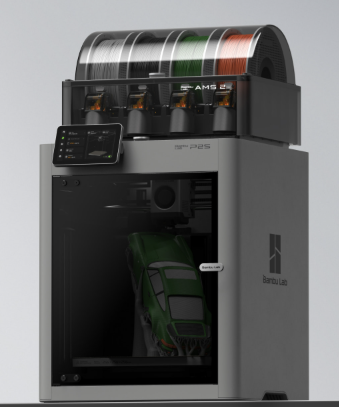
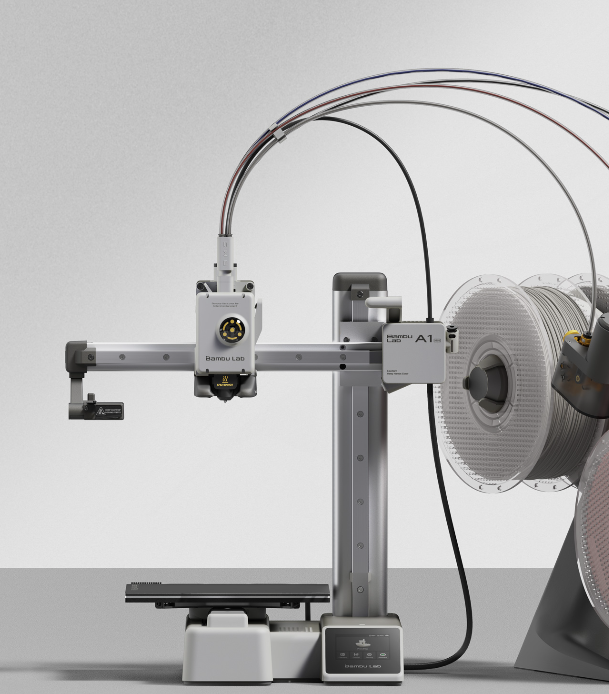
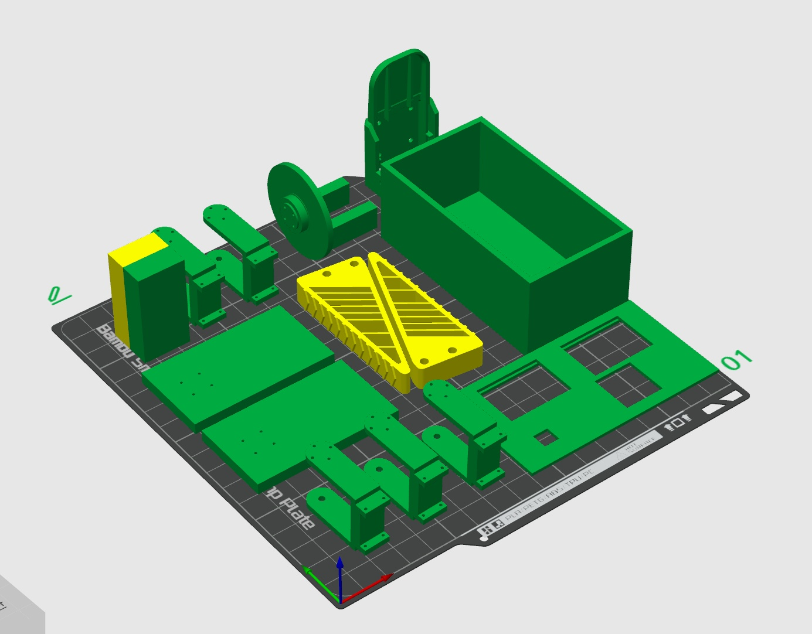
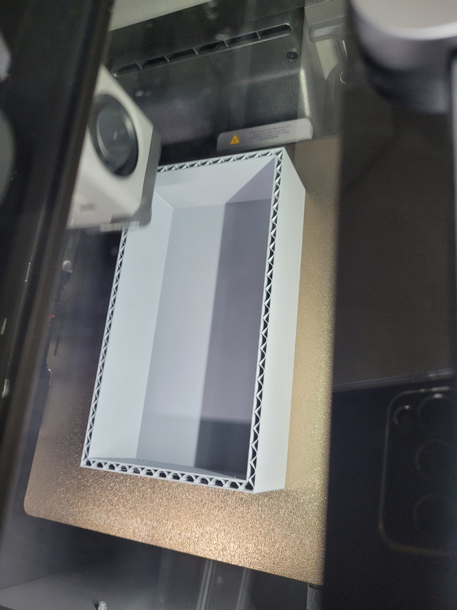
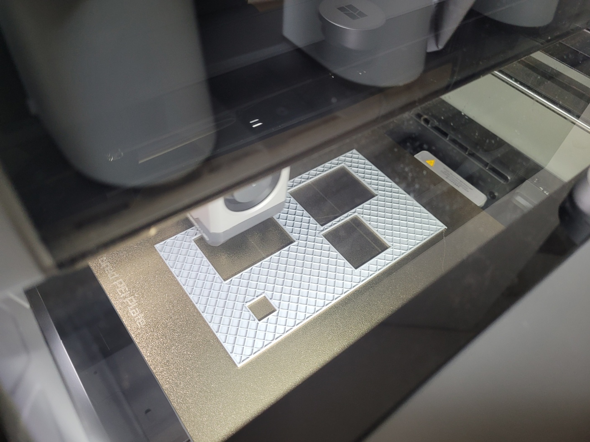
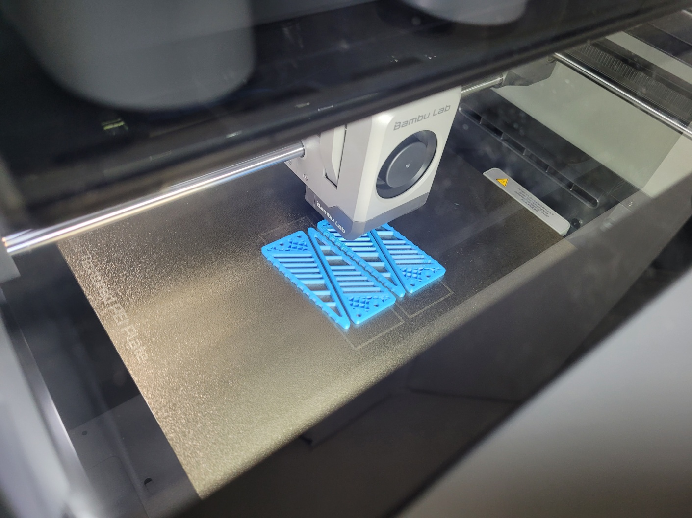
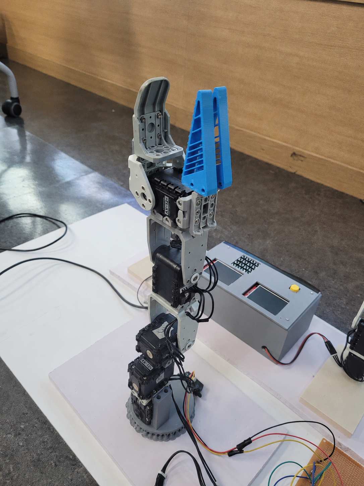
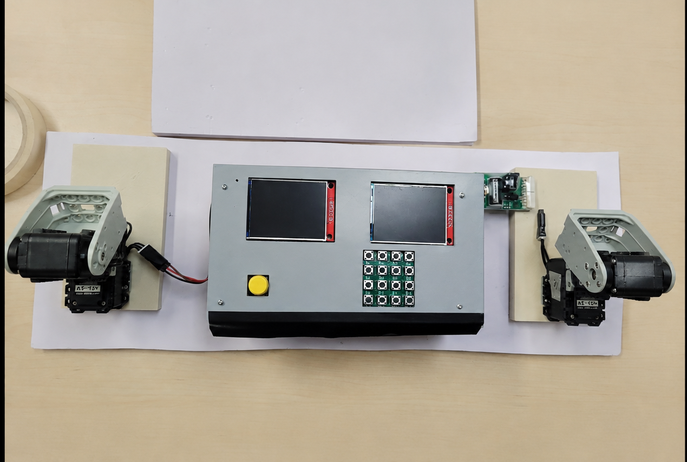

<p align="center">
  
</p>

# ARMIGO 4-Axis Robot Arm

STM32 NUCLEO-F411RE 2대와 DYNAMIXEL AX-12A 8개를 이용해 제작한  
**4축 마스터-슬레이브 로봇팔 제어 시스템**입니다.

마스터 로봇팔의 현재 자세를 읽어 슬레이브 로봇팔에 전달하며, 키패드 기반 수동 조작, Teaching, Preset 저장, Sharp 적외선 센서 기반 자동 동작, 비상정지 기능을 지원합니다.

---

## 결과물

### 1. 수동 조작 모드

마스터 로봇팔을 직접 움직이면 슬레이브 로봇팔이 실시간으로 동작을 따라갑니다.

<p align="center">
  
</p>

### 2. Teaching 실행 모드

Teaching 모드에서 저장한 동작을 선택한 Preset 순서에 따라 자동으로 실행합니다.

#### 로봇팔 동작

<p align="center">
  
</p>

#### 제어기 화면

Teaching Preset 선택, Step 실행 및 동작 상태가 표시되는 제어기 화면입니다.

<p align="center">
  
</p>

---

## 프로젝트 개요

| 항목 | 내용 |
|---|---|
| 프로젝트명 | ARMIGO 4-Axis Robot Arm |
| 개발 언어 | C |
| MCU | STM32 NUCLEO-F411RE × 2 |
| 모터 | DYNAMIXEL AX-12A × 8 |
| 운영 구조 | Master Controller + Slave Controller |
| RTOS | FreeRTOS |
| 빌드 | CMake |
| 통신 | USART Half-Duplex, UART |
| 센서 | Sharp GP2Y0A21YK0F 적외선 거리 센서 |
| 주요 기능 | JOG, Teaching, Preset, Auto, Home, E-STOP |

---

## 시스템 구성

```text
Master AX-12A x4
ID: 10, 11, 12, 14
        │
        │ USART1 Half-Duplex / 1 Mbps
        ▼
┌─────────────────────────────┐
│ AX_MASTER                   │
│ STM32 NUCLEO-F411RE         │
│                             │
│ Keypad / LCD / E-STOP       │
│ Teaching / Preset / Auto    │
└─────────────────────────────┘
        │
        │ USART6 / 115200 bps
        │ 또는 HC-05
        ▼
┌─────────────────────────────┐
│ AX_SLAVE                    │
│ STM32 NUCLEO-F411RE         │
│                             │
│ Sharp IR Sensor / AX-12A    │
└─────────────────────────────┘
        │
        │ USART1 Half-Duplex / 1 Mbps
        ▼
Slave AX-12A x4
ID: 1, 2, 3, 5
```

---

## 저장소 구조

```text
armigo-robot-arm/
├── README.md
│
├── master/
│   ├── AX_MASTER.ioc
│   ├── Core/
│   ├── Drivers/
│   ├── CMakeLists.txt
│   └── README.md
│
├── slave/
│   ├── AX_SLAVE.ioc
│   ├── Core/
│   ├── Drivers/
│   ├── CMakeLists.txt
│   └── README.md
│
└── docs/
    └── assets/
        ├── manual-control.gif
        ├── teaching-playback.gif
        └── teaching-controller.gif
```

- `master/`: 마스터 로봇팔 제어 펌웨어
- `slave/`: 슬레이브 로봇팔 제어 펌웨어
- `docs/assets/manual-control.gif`: 수동 조작 모드 결과물 GIF
- `docs/assets/teaching-playback.gif`: Teaching 실행 로봇팔 동작 GIF
- `docs/assets/teaching-controller.gif`: Teaching 실행 제어기 화면 GIF

각 하위 폴더의 README에는 해당 컨트롤러의 세부 구현 내용이 정리되어 있습니다.

---

## 주요 기능

### 1. Master 자세 추종

마스터 AX-12A 4개의 현재 위치를 읽어 슬레이브 컨트롤러로 전달합니다.

슬레이브는 전달받은 위치를 각 AX-12A의 목표 위치로 설정하여 마스터 로봇팔의 움직임을 따라갑니다.

### 2. Admin JOG

키패드를 이용해 각 축을 직접 움직이고 로봇팔의 자세를 조정할 수 있습니다.

### 3. Teaching 및 Preset 저장

사용자가 만든 로봇팔 자세를 STM32 Flash에 저장할 수 있습니다.

- Preset: 1~10
- Preset당 최대 Step: 30개
- 저장된 Step을 순서대로 자동 실행
- 전원을 다시 켜도 저장 데이터 유지

### 4. Sharp 센서 기반 Auto 모드

Sharp 적외선 센서가 물체를 감지하면 선택한 Teaching Preset을 자동으로 실행합니다.

```text
물체가 10~17cm 범위에 진입
        ↓
유효 샘플 3회 연속 확인
        ↓
5초 동안 감지 상태 유지
        ↓
선택한 Preset 실행
        ↓
전체 Step 완료
        ↓
Master / Slave 모두 Home 위치로 복귀
        ↓
물체가 감지 범위를 벗어난 뒤 재무장
```

감지 범위를 벗어난 샘플도 3회 연속 확인한 뒤 감지를 해제하여 순간적인 센서 노이즈로 Auto 카운트다운이 초기화되지 않도록 구성했습니다.

### 5. Home

Master와 Slave의 모든 축을 중앙 위치 `512`로 이동합니다.

양쪽 로봇팔이 모두 목표 위치에 도착한 경우에만 Home 완료로 판정합니다.

### 6. E-STOP

비상정지 버튼이 눌리면 실행 중인 Home, JOG, Auto 동작을 즉시 중단합니다.

슬레이브는 이전 목표 위치나 캐시값이 아니라, 비상정지 순간 각 모터의 실제 Present Position을 다시 읽어 해당 위치를 Goal로 설정합니다.

---

## 키패드 조작

| 입력 | 기능 |
|---|---|
| BTN16 | Home 위치 `512` 이동 |
| BTN15 | Admin JOG 진입 또는 Dashboard 복귀 |
| BTN13 | Teaching 모드 진입 |
| BTN1~10 | Teaching 또는 Auto Preset 선택 |
| BTN12 | 현재 자세를 다음 Step으로 저장 |
| BTN11 | 선택한 Preset 전체 삭제 |
| BTN14 | Auto 센서 모드 진입 |

### Teaching 사용 순서

1. BTN13을 눌러 Teaching 모드로 진입합니다.
2. BTN1~10 중 하나를 눌러 Preset을 선택합니다.
3. 로봇팔을 원하는 자세로 움직입니다.
4. BTN12를 눌러 현재 자세를 Step으로 저장합니다.
5. 다음 자세를 만든 뒤 BTN12를 반복합니다.

### Auto 사용 순서

1. BTN16을 눌러 Home을 완료합니다.
2. BTN14를 눌러 Auto 센서 모드로 진입합니다.
3. BTN1~10으로 실행할 Preset을 선택합니다.
4. Sharp 센서가 물체를 감지하면 5초 후 Preset을 실행합니다.
5. 실행 완료 후 양쪽 로봇팔이 Home 위치로 복귀합니다.

---

## 모터 ID

### Master

| 축 | AX-12A ID |
|---:|---:|
| 1 | 10 |
| 2 | 11 |
| 3 | 12 |
| 4 | 14 |

### Slave

| 축 | AX-12A ID |
|---:|---:|
| 1 | 1 |
| 2 | 2 |
| 3 | 3 |
| 4 | 5 |

Slave ID `2`는 그리퍼에 사용되며, 물체를 과도하게 압착하거나 모터가 장시간 스톨 상태에 머무르지 않도록 Torque Limit `300/1023`을 적용했습니다.

---

## Master-Slave 연결

```text
AX_MASTER USART6 TX PA11 ──> AX_SLAVE USART6 RX PC7
AX_MASTER USART6 RX PA12 <── AX_SLAVE USART6 TX PC6
GND ──────────────────────── GND
```

AX-12A 버스는 USART1 Half-Duplex `1 Mbps`를 사용합니다.

AX-12A에는 외부 `9~12V` 전원을 공급하고, 외부 전원 GND와 STM32 GND를 반드시 공통으로 연결해야 합니다.

---

## Fusion UART 프로토콜

```text
AA 55 CMD LEN PAYLOAD... CHECKSUM
```

Checksum은 다음 값의 하위 8비트입니다.

```text
CMD + LEN + PAYLOAD
```

| CMD | 이름 | 기능 |
|---:|---|---|
| `0x01` | SET_GOAL_POS | 개별 축 목표 위치 설정 |
| `0x02` | SET_TORQUE | Slave Torque 설정 |
| `0x03` | REQ_STATUS | Slave 상태 요청 |
| `0x04` | HOME_POS | 4축 Home 이동 |
| `0x05` | SET_ALL_POS | JOG 또는 Teaching 위치 전송 |
| `0x06` | START_AUTO | 첫 Auto Step 준비 |
| `0x07` | RUN_AUTO | 다음 Auto Step 실행 |
| `0x08` | HOLD_CURRENT | 현재 실제 위치 고정 |
| `0x83` | STATUS_REPLY | Slave 상태 회신 |

### STATUS_REPLY Payload

```text
Position 8B
+ Load 8B
+ 상태 플래그 1B
+ Sharp 전압 2B
+ Sharp 거리 1B
= 총 20B
```

Master와 Slave는 반드시 동일한 프로토콜 및 상태 프레임 버전을 사용해야 합니다.

한쪽 펌웨어만 변경하면 Master가 Slave의 상태 응답을 무시하거나 Home 상태가 계속 `MOVING`으로 남을 수 있습니다.

---

## TelePlot

각 보드의 USART2와 ST-LINK Virtual COM Port를 `115200, 8N1`로 연결합니다.

### Master 출력 예시

```text
>master_sharp_mv:1234
>master_sharp_cm:25
>master_sharp_detected:1
>auto_selected_preset:3
>auto_countdown:5
```

### Slave 출력 예시

```text
>sharp_mv:1234
>sharp_cm:25
>sharp_detected:1
>slave_1_pos:512
```

---

## 빌드

### Master

```bash
cd master
cmake --preset Debug
cmake --build --preset Debug
```

결과 파일:

```text
master/build/Debug/AX_MASTER.elf
```

### Slave

```bash
cd slave
cmake --preset Debug
cmake --build --preset Debug
```

결과 파일:

```text
slave/build/Debug/AX_SLAVE.elf
```

운영체제가 바뀐 경우 기존 `build/Debug` 캐시를 재사용하지 말고 CMake 캐시를 삭제한 뒤 다시 구성합니다.

---

## 주요 파일

### Master

| 파일 | 역할 |
|---|---|
| `master/AX_MASTER.ioc` | CubeMX 핀, UART, FreeRTOS 설정 |
| `master/Core/Src/freertos.c` | 키패드, 모드, LCD, 통신, E-STOP |
| `master/Core/Src/ax12.c` | AX-12 Protocol 1.0 드라이버 |
| `master/Core/Src/teaching_storage.c` | Teaching Flash 저장 |
| `master/Core/Inc/ax12_config.h` | 모터 ID, 속도, 모션 설정 |

### Slave

| 파일 | 역할 |
|---|---|
| `slave/AX_SLAVE.ioc` | CubeMX 핀, UART, FreeRTOS 설정 |
| `slave/Core/Src/ax12_app.c` | Fusion 명령, 모션, 상태 회신 |
| `slave/Core/Src/main.c` | Sharp ADC 측정 및 거리 환산 |
| `slave/Core/Src/freertos.c` | 센서, Slave, TelePlot 태스크 |
| `slave/Core/Inc/ax12_config.h` | 프로토콜, 모터 ID, 모션 설정 |

---

## 트러블슈팅

### AX-12A 다축 확장 시 특정 축 통신 실패

2축 구성에서는 정상 동작했지만 3축 이상에서 통신이 실패하는 문제가 발생했습니다.

UART 설정과 AX12 축 개수를 점검한 뒤 개별 모터를 교차 테스트하여 AX-12A ID `10` 모터 자체의 고장이 원인임을 확인했습니다.

### Half-Duplex 통신 불안정

내부 Pull-up 설정만으로 통신이 불안정한 문제가 발생해 외부 Pull-up 저항을 추가하여 통신을 안정화했습니다.

### 비상정지 후 이전 목표 재실행

캐시된 목표 위치를 기준으로 정지하면 비상정지 해제 후 이전 Auto 목표가 다시 실행될 수 있었습니다.

이를 해결하기 위해 `HOLD_CURRENT` 명령 수신 시 각 모터의 실제 Present Position을 읽어 Goal과 Target에 동시에 반영하도록 수정했습니다.

---

## 기존 저장소

이 저장소는 아래 두 프로젝트를 하나의 저장소로 통합한 버전입니다.

- Master: `Armigos/AX_MASTER`
- Slave: `Armigos/AX_SLAVE`

원본 저장소의 커밋 이력을 유지한 상태로 각각 `master/`, `slave/` 디렉터리에 통합합니다.

---

## 3D 설계 및 제작

ARMIGO 로봇팔의 프레임, 그리퍼, 제어기 케이스 및 보조 부품은 직접 모델링하고 3D 프린팅하여 제작했습니다.

### 사용 도구

<table>
  <tr>
    <td align="center" width="50%">
      
      <br>
      <b>Bambu Studio</b>
      <br>
      3D 프린팅 슬라이싱 및 출력 설정
    </td>
    <td align="center" width="50%">
      
      <br>
      <b>Rhino 8</b>
      <br>
      로봇팔 부품 및 제어기 케이스 3D 모델링
    </td>
  </tr>
</table>

### 3D 프린터 및 필라멘트

<table>
  <tr>
    <td align="center" width="50%">
      
      <br>
      <b>Bambu Lab P2S</b>
    </td>
    <td align="center" width="50%">
      
      <br>
      <b>Bambu Lab A1 mini</b>
    </td>
  </tr>
</table>

사용한 필라멘트:

- **PLA Matte**: 로봇팔 프레임, 케이스 및 일반 구조물
- **PLA Basic**: 기본 구조 부품 및 테스트 출력
- **TPU 95A HF**: 물체와 접촉하는 유연한 그리퍼 Blade

### 3D 프린팅 부품 전체 구성

<p align="center">
  
</p>

로봇팔 링크, 베이스, 그리퍼 Blade, 제어기 케이스와 패널 등 출력 전에 배치한 전체 부품 구성입니다.

### 출력 과정

<table>
  <tr>
    <td align="center" width="33%">
      
      <br>
      <b>제어기 케이스 출력</b>
    </td>
    <td align="center" width="33%">
      
      <br>
      <b>제어기 패널 출력</b>
    </td>
    <td align="center" width="33%">
      
      <br>
      <b>TPU 그리퍼 Blade 출력</b>
    </td>
  </tr>
</table>

### 제작 결과

<table>
  <tr>
    <td align="center" width="50%">
      
      <br>
      <b>완성된 로봇팔 및 그리퍼</b>
    </td>
    <td align="center" width="50%">
      
      <br>
      <b>제어기와 Master-Slave 구성</b>
    </td>
  </tr>
</table>
